# Proposta: Camada de Abstração para Integração com Flows API

## Resumo Executivo

Este documento apresenta uma camada de abstração implementada no `agents-toolkit` para simplificar e padronizar a integração das Tools com a API do Flows.

---

## 1. Problema Atual

### Cenário Antes da Abstração

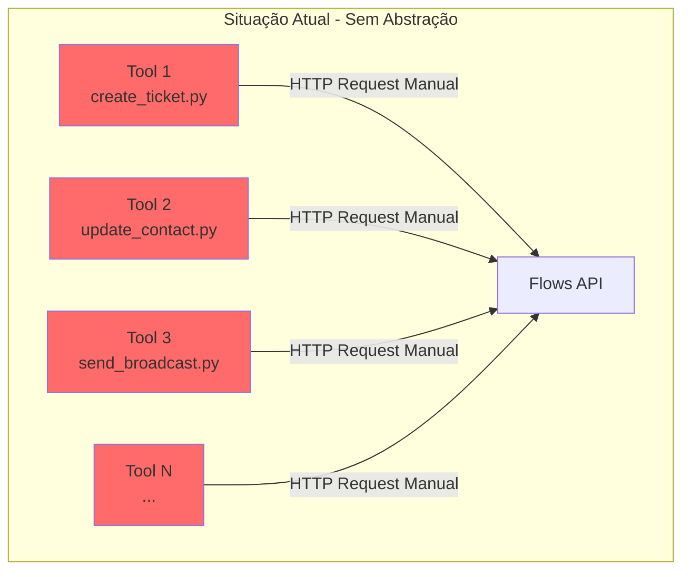

### Problemas Identificados

| Problema | Impacto |
|----------|---------|
| **Código duplicado** | Cada tool reimplementa lógica de autenticação e requests |
| **Inconsistência** | Diferentes tratamentos de erro entre tools |
| **Manutenção difícil** | Mudanças na API do Flows requerem alterações em múltiplas tools |
| **Curva de aprendizado** | Desenvolvedores precisam entender detalhes da API do Flows |
| **Bugs recorrentes** | Mesmos erros se repetem em diferentes implementações |

---

## 2. Solução Proposta

### Arquitetura com Camada de Abstração

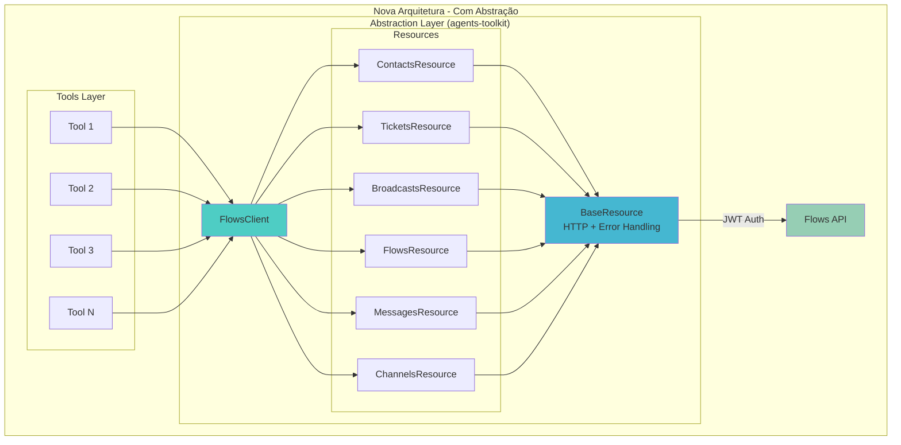

---

## 3. Fluxo de Autenticação JWT

### Como o JWT é utilizado

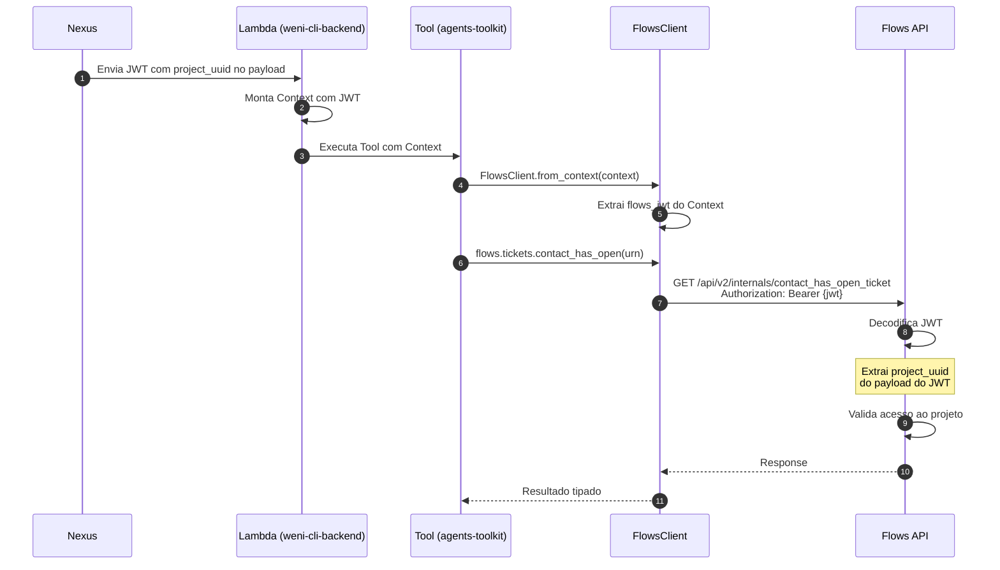

### Estrutura do JWT

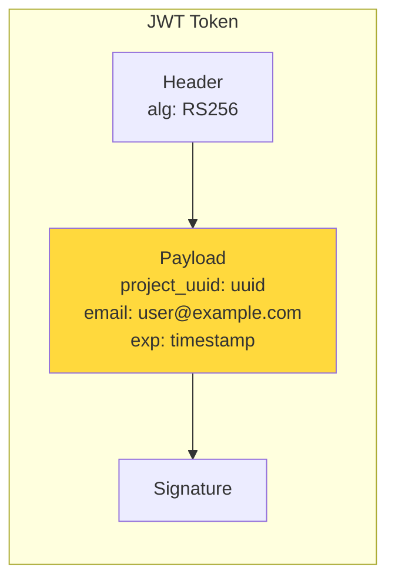

**Importante:** O `project_uuid` está **dentro do JWT**, não é passado como parâmetro. O Flows extrai automaticamente.

---

## 4. Arquitetura de Componentes

### Estrutura do Módulo

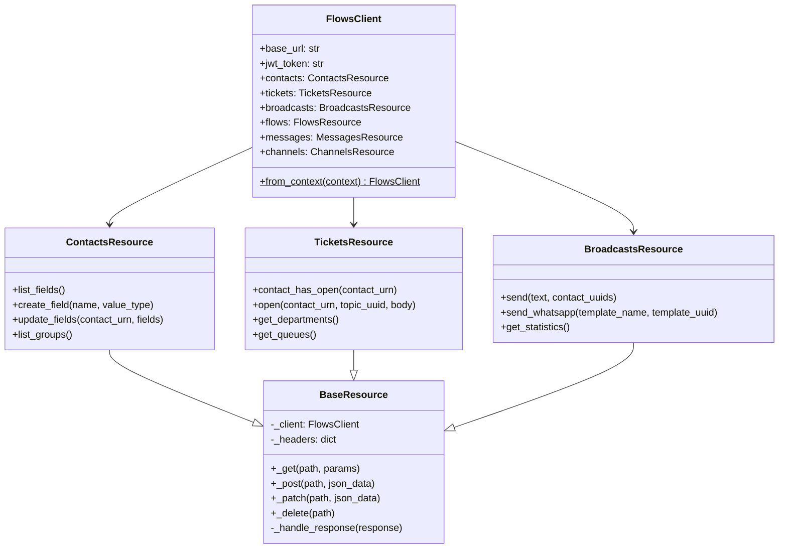

---

## 5. Fluxo de Execução de uma Tool

### Exemplo: Tool que verifica ticket e atualiza contato

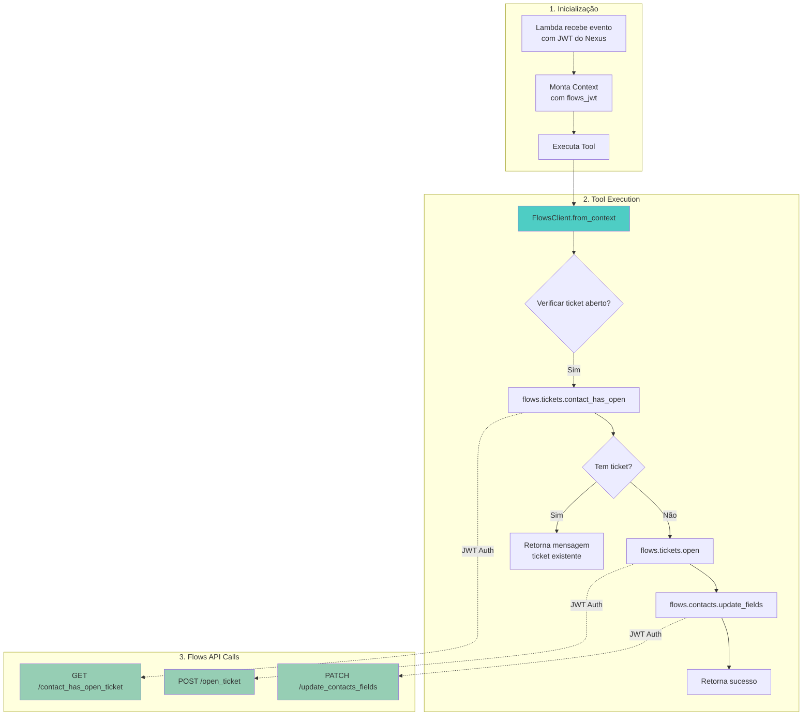

---

## 6. Tratamento de Erros

### Hierarquia de Exceções

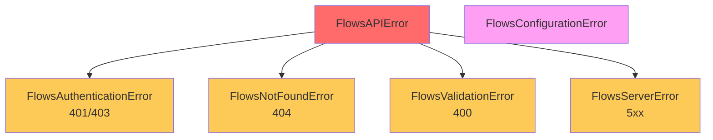

### Fluxo de Error Handling

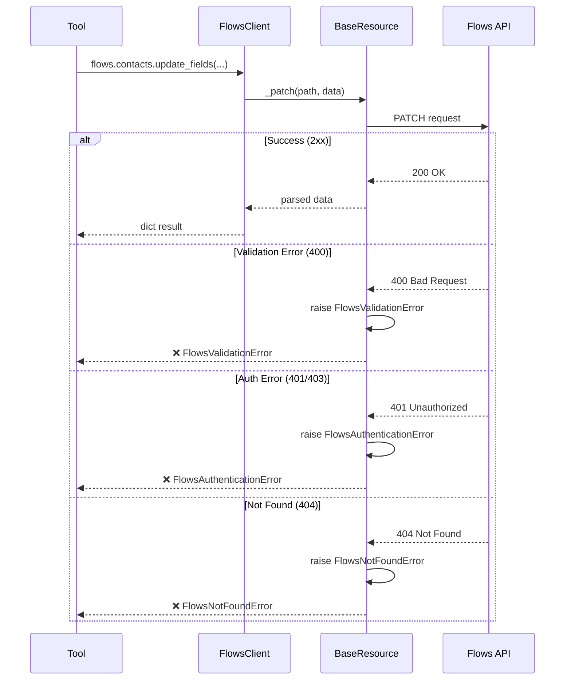

---

## 7. Comparação: Antes vs Depois

### Código ANTES (sem abstração)

```python
import requests
import json

class CreateTicketTool(Tool):
    def execute(self, context: Context):
        # Extrair JWT manualmente
        jwt = context.credentials.get("jwt")
        flows_url = context.credentials.get("flows_url")
        
        # Construir headers manualmente
        headers = {
            "Authorization": f"Bearer {jwt}",
            "Content-Type": "application/json"
        }
        
        # Verificar ticket existente
        response = requests.get(
            f"{flows_url}/api/v2/internals/contact_has_open_ticket",
            headers=headers,
            params={"contact_urn": context.contact.get("urn")}
        )
        
        # Tratamento de erro manual
        if response.status_code != 200:
            return {"error": "Failed to check ticket"}
        
        data = response.json()
        if data.get("has_open_ticket"):
            return {"message": "Already has ticket"}
        
        # Abrir ticket
        response = requests.post(
            f"{flows_url}/api/v2/internals/open_ticket",
            headers=headers,
            json={
                "contact_urn": context.contact.get("urn"),
                "body": "Customer needs help"
            }
        )
        
        # Mais tratamento de erro...
        if response.status_code != 201:
            return {"error": "Failed to open ticket"}
        
        return {"success": True}
```

### Código DEPOIS (com abstração)

```python
from weni.flows import FlowsClient

class CreateTicketTool(Tool):
    def execute(self, context: Context):
        flows = FlowsClient.from_context(context)
        contact_urn = context.contact.get("urn")
        
        # Verificar ticket existente
        if flows.tickets.contact_has_open(contact_urn):
            return {"message": "Already has ticket"}
        
        # Abrir ticket
        ticket = flows.tickets.open(
            contact_urn=contact_urn,
            body="Customer needs help"
        )
        
        return {"success": True, "ticket_id": ticket.get("uuid")}
```

### Métricas de Melhoria

| Métrica | Antes | Depois | Melhoria |
|---------|-------|--------|----------|
| Linhas de código | ~45 | ~15 | **-67%** |
| Imports necessários | 3 | 1 | **-67%** |
| Pontos de erro manual | 4+ | 0 | **-100%** |
| Tempo de desenvolvimento | ~2h | ~20min | **-83%** |

---

## 8. Repositórios Envolvidos

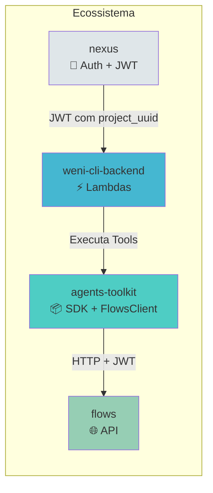

---

## 9. Endpoints Suportados

### Resources e Métodos Disponíveis

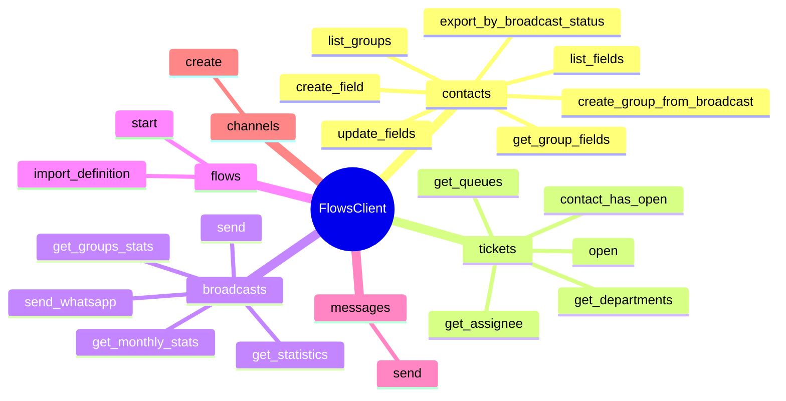

---

## 10. Próximos Passos

### Roadmap de Implementação

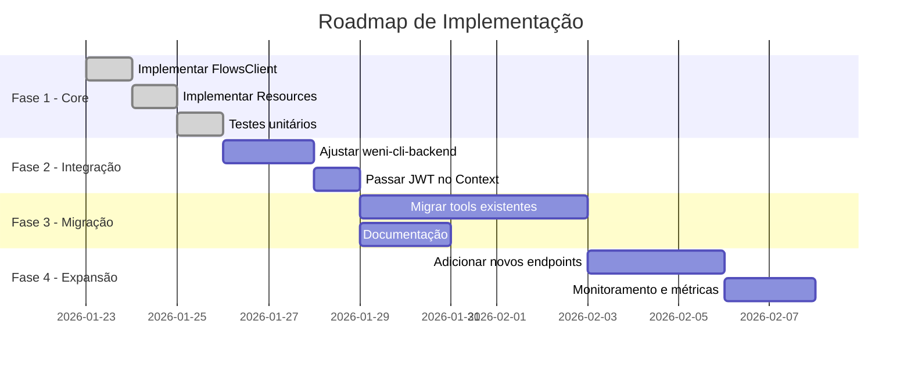

---

## 11. Benefícios Consolidados

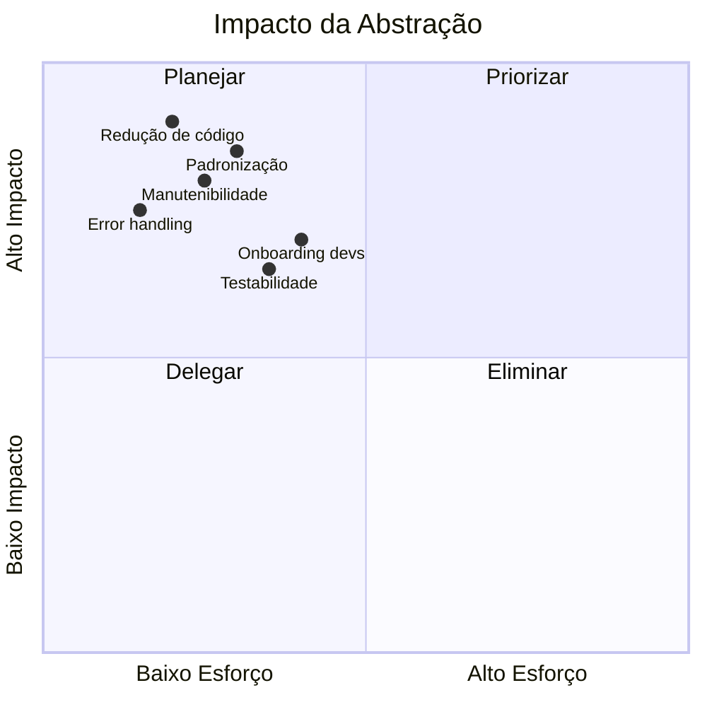

### Resumo de Benefícios

| Benefício | Descrição |
|-----------|-----------|
| 🔄 **DRY** | Código de integração escrito uma vez, usado em todas as tools |
| 🛡️ **Segurança** | Autenticação JWT centralizada e consistente |
| 🐛 **Debugging** | Erros tipados facilitam identificação de problemas |
| 📚 **Documentação** | API clara e auto-documentada |
| 🧪 **Testabilidade** | Resources facilmente mockáveis |
| ⚡ **Produtividade** | Desenvolvedores focam na lógica de negócio |

---

## 12. Conclusão

A camada de abstração `FlowsClient` no `agents-toolkit` resolve problemas críticos de duplicação de código, inconsistência e manutenibilidade, proporcionando uma interface limpa e ergonômica para integração com a API do Flows.

**Recomendação:** Aprovar a implementação e iniciar a migração gradual das tools existentes.

---

*Documento gerado em: Janeiro 2026*  
*Versão: 1.0*
